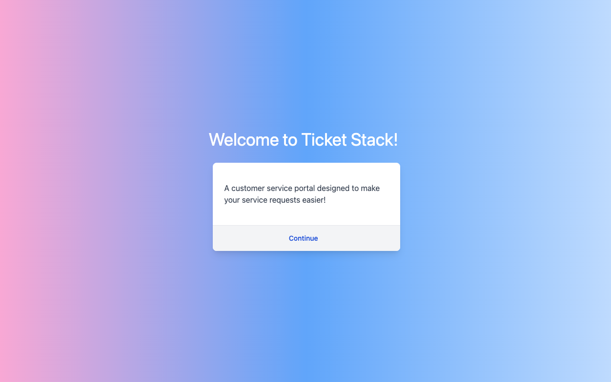
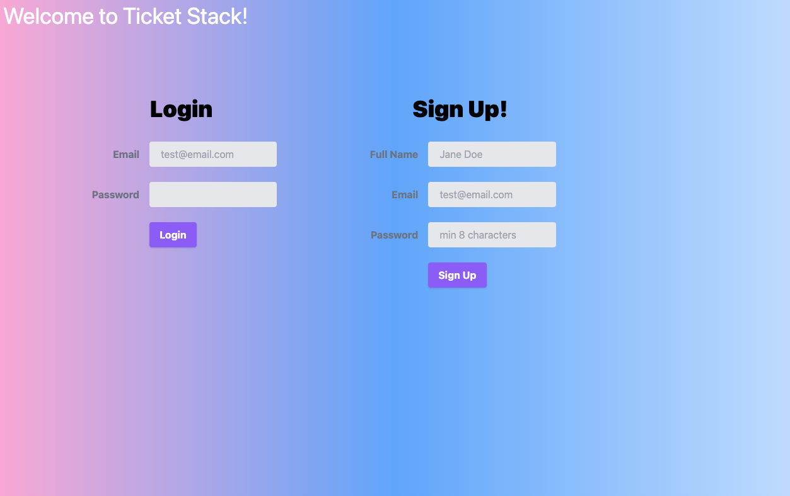
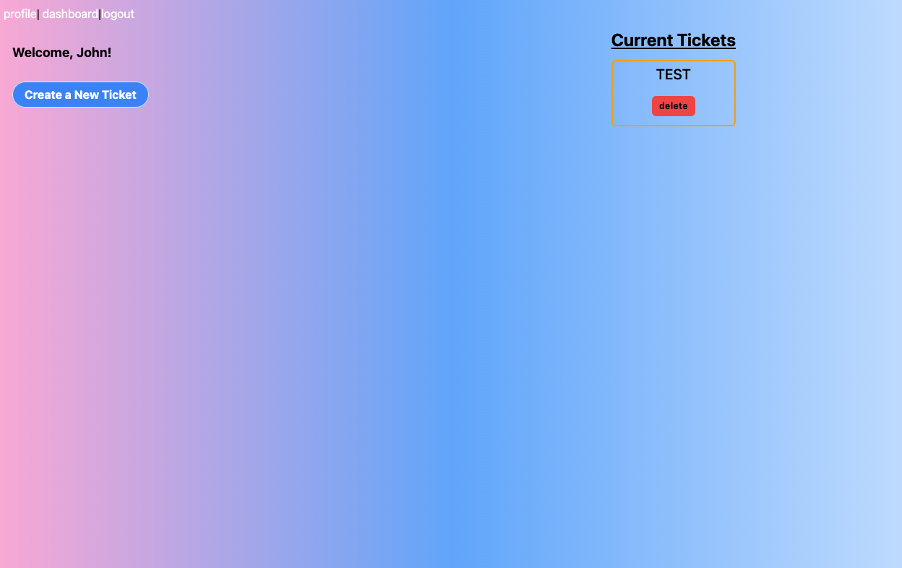

# Ticket Stack

# Link to Public Repo on Github:
https://github.com/justinkemp10/customer_service_portal

# Link to Public Heroku Application:
https://customer-service-dashboard.herokuapp.com/

## Table of Contents
1. [Description](#Description)
2. [User Story](#User-Story)
3. [Initialization](#Initialization)
4. [License](#License)
5. [Questions](#Questions)

## Description
This application is a customer service experience app that is designed for businesses to use to track individual customer service requests for their customers. Once a customer signs up, they are given access to create & submit a customer service ticket. They are presented with a form to fill out and when it's completed, the ticket is generated and added to their "Current Tickets" list. 

Further development will include administrative credentials that allow the business to respond to tickets and interact with their customers directly.

## User Story
    As a business who serves customers
    I WANT to be able to interact with my customers to review their experiences
    SO THAT I can provide the best products and service to meet my customer needs.

## Initialization
- Download project files via Github
- Open server.js file and change the password field to your own MySQL password
- Open Terminal and proceed to type "npm install"
- From here we will move to our database so type "cd db/" then type "mysql -u root -p" and enter your personal password. Now we will type "source schema.sql" 
- To exit MySQL we will type "exit" then proceed to type "npm run seed" and "npm run watch"
- Now the database is created, you can use the application and it will store data given by the user

## Screenshots

## Mobile

## License
- MIT License
- Copyright 2021
    Permission is hereby granted, free of charge, to any person obtaining a copy of this software and associated documentation files (the "Software"), to deal in the Software without restriction, including without limitation the rights to use, copy, modify, merge, publish, distribute, sublicense, and/or sell copies of the Software, and to permit persons to whom the Software is furnished to do so, subject to the following conditions:
    
    The above copyright notice and this permission notice shall be included in all copies or substantial portions of the Software.
    
    THE SOFTWARE IS PROVIDED "AS IS", WITHOUT WARRANTY OF ANY KIND, EXPRESS OR IMPLIED, INCLUDING BUT NOT LIMITED TO THE WARRANTIES OF MERCHANTABILITY, FITNESS FOR A PARTICULAR PURPOSE AND NONINFRINGEMENT. IN NO EVENT SHALL THE AUTHORS OR COPYRIGHT HOLDERS BE LIABLE FOR ANY CLAIM, DAMAGES OR OTHER LIABILITY, WHETHER IN AN ACTION OF CONTRACT, TORT OR OTHERWISE, ARISING FROM, OUT OF OR IN CONNECTION WITH THE SOFTWARE OR THE USE OR OTHER DEALINGS IN THE SOFTWARE.
## Questions
- GitHub Profile: <a href="https://github.com/justinkemp10/customer_service_portal">Click Here</a> 
